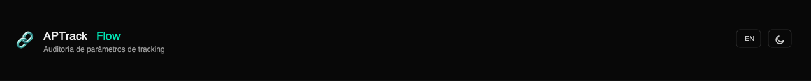

<div align="center">
  
</div>

# APTrack Flow

**Tracking Parameter Audit**

  

**Versión en español:** [README.md](README.md)

A free, local tool to audit whether tracking parameters (`gclid`, `utm_*`, `fbclid`, etc.) survive navigation and redirects on a website. Everything runs on your computer — no npm dependencies, no external services.

---

## What it does

Give it a site URL and the name of the parameter you want to test, and APTrack Flow:

- Crawls the site by following internal links (`<a href>`) starting from the initial URL, and also follows `<meta http-equiv="refresh">` redirects
- Appends the test parameter to each URL found and follows redirects to the final page
- Detects whether the parameter **survived** or was **lost**, whether there was a real redirect, and whether the page strips the parameter with JavaScript after loading (`history.replaceState`/`pushState`)
- Shows progress in real time (crawl and test log, streaming)
- Builds a final summary (retention %, redirects, errors) with a filterable, numbered table
- Exports results to **CSV** in one click
- Bilingual interface (**Spanish / English**) with **dark and light theme**

---

## Before you start: install Node.js

APTrack Flow requires **Node.js v18 or higher**. If you already have it installed, skip this step.

### Mac

1. Open your browser and go to **https://nodejs.org**
2. Click the green **"LTS"** button (recommended version)
3. A `.pkg` file downloads — double-click it and follow the installer
4. To verify, open the **Terminal** app (`⌘ + Space`, type "Terminal") and run:
   ```bash
   node --version
   ```
   You should see something like `v20.0.0` or higher.

### Windows

1. Open your browser and go to **https://nodejs.org**
2. Click the green **"LTS"** button (recommended version)
3. A `.msi` file downloads — double-click it and follow the installer (keep all default options)
4. To verify, open **Command Prompt** (search "cmd" in the Start menu) and run:
   ```
   node --version
   ```
   You should see something like `v20.0.0` or higher.

### Linux (Ubuntu / Debian)

Open a terminal and run:

```bash
curl -fsSL https://deb.nodesource.com/setup_lts.x | sudo -E bash -
sudo apt-get install -y nodejs
```

For other distros (Fedora, Arch, etc.), follow the instructions at **https://nodejs.org/en/download/package-manager**

---

## Downloading APTrack Flow

### Option A — ZIP (easiest, no extra installs)

1. Go to the project's GitHub page
2. Click the green **"Code"** button
3. Select **"Download ZIP"**
4. Unzip the file into the folder of your choice (e.g. `Documents/aptrack-flow`)

### Option B — git clone

```bash
git clone https://github.com/mdmarein/aptrack-flow.git
cd aptrack-flow
```

---

## Running the application

There are two ways to start APTrack Flow: from the terminal, or as a desktop app with an icon.

---

### Option 1 — From the terminal

#### Mac / Linux

Open a terminal in the project folder and run:

```bash
node server.js
```

#### Windows

Open Command Prompt in the project folder and run:

```
node server.js
```

---

### Option 2 — Install as an app with an icon (recommended)

You can create a desktop shortcut with an icon to open APTrack Flow with a double-click, without using the terminal.

#### Mac — Create "APTrack Flow.app"

1. Open a terminal in the project folder
2. Run:
   ```bash
   bash tools/make-mac-app.sh
   ```
3. **"APTrack Flow.app"** is created on your Desktop
4. **First time:** right-click the icon → **Open** (macOS asks for confirmation once)
5. **After that:** just double-click

> The app starts the server automatically and opens your browser at `http://localhost:3300`. If the server is already running, it restarts it to ensure the latest code is always loaded.

#### Windows — Create a shortcut

1. Open the project folder in File Explorer
2. Go into the `tools` folder
3. Double-click **`make-win-shortcut.bat`**
4. **"APTrack Flow"** is created on your Desktop
5. Double-click the icon to start the app

> If you get a permissions error, right-click → **Run as administrator**.

---

### Opening the app in your browser

If you used the terminal option, with the server running open your browser and go to:

```
http://localhost:3300
```

If you used the installed icon, the browser opens automatically.

To stop the server from the terminal: press `Ctrl + C`.

**Change port (optional):**
```bash
PORT=8080 node server.js          # Mac / Linux
set PORT=8080 && node server.js   # Windows
```

---

## Usage guide

1. **Initial URL** — enter the URL of the site you want to audit (e.g. `https://mycampaignsite.com`)
2. **Parameter** — the name of the parameter to test (e.g. `gclid`) and the test value (e.g. `test123`)
3. **Options** — adjust the maximum number of URLs to crawl (default 30, max 200), the delay between requests, and the timeout per request
4. **Start audit** — the live log shows each URL as it is crawled and tested
5. **Results** — when finished, a summary appears showing:
   - Parameter retention percentage
   - Number of redirects detected
   - URLs where the parameter was lost
   - URLs with JavaScript-based stripping (`history.replaceState`/`pushState`)
   - Network errors
6. **Table** — filter by status (survived / lost / error / redirect) using the table buttons
7. **Export** — download all results as CSV with the download button

---

## Language and theme

- **Language**: `EN`/`ES` button in the header. Switching language reloads the page.
- **Theme**: sun/moon button in the header, dark by default. Does not reload the page.

Both preferences are saved in `localStorage` and persist across sessions.

---

## Exports

| File | Content |
|------|---------|
| **Results CSV** | One row per audited URL: status (survived / lost / error), final URL, redirect type, JS detection notes |

---

## Known limitations

- Does not execute JavaScript — if a site redirects client-side (`location.replace()`) or strips parameters from the URL with JS after loading, APTrack Flow can only detect it heuristically (known code patterns), not confirm it with certainty — that would require a headless browser.
- Does follow `<meta http-equiv="refresh">`, which is a declarative HTML mechanism (no JS execution needed).
- Some WAFs block HTTP clients not identified as a browser; the default User-Agent honestly identifies itself as an audit bot (avoids the most common block pattern: "claims to be a browser but doesn't behave like one"). As an additional fallback, if the response returns a typical block status (403/406/429/451/503), it automatically retries using the system's `curl`.

---

## Project structure

```
aptrack-flow/
├── server.js                  Pure HTTP server (no Express) — 1 audit endpoint
├── start.sh / start.bat       Terminal start scripts (Mac/Linux · Windows)
├── lib/
│   └── link-auditor.js        Engine: link crawling + parameter testing + NDJSON streaming
├── public/
│   ├── index.html
│   ├── css/styles.css         Design tokens shared with DataB Flow
│   ├── img/                   Favicons + logos
│   └── js/
│       ├── main.js            UI: form, live progress, results, CSV export
│       └── modules/i18n.js    ES/EN internationalization
└── tools/
    ├── make-mac-app.sh        Creates "APTrack Flow.app" (Mac)
    ├── make-win-shortcut.bat  Creates Desktop shortcut (Windows)
    ├── launch-windows.vbs     Silent launcher (Windows)
    └── icons/                 AppIcon.icns / APTrack-flow.ico
```

---

## Architecture

### What is it?

A tracking parameter survival audit tool. Runs locally in the browser (`localhost:3300`), with a Node.js backend and a vanilla JavaScript frontend. No npm dependencies. 100% offline except for access to the audited site.

### Tech stack

| Layer | Technology |
|-------|-----------|
| **Backend** | Pure Node.js (no Express), CommonJS, 0 external dependencies, 1 REST endpoint |
| **Frontend** | JavaScript ES6 modules + Vanilla JS, CSS3 variables for dark/light themes |
| **HTTP** | Native Node 18+ `fetch`, `AbortController` for manual timeout |
| **Streaming** | NDJSON over `POST` — one JSON line per progress event |
| **Crawling** | Regex over `<a href>` + `<meta http-equiv="refresh">` detection — no DOM parser |
| **Export** | Client-side CSV generation via Blob URL download |
| **Storage** | `localStorage` for UI preferences (language, theme) — no database |

### Data flow

```
URL + parameter → POST /api/audit
    → Crawl internal links (up to maxUrls)
    → For each URL: append parameter + follow redirects → detect survival
    → NDJSON streaming → Frontend renders live progress
    → Final summary → Filterable table + CSV export
```

### Key architecture decisions

- **Server-side crawling** — fetching third-party sites runs in `server.js` to avoid CORS blocks from campaign landing pages
- **NDJSON over SSE** — uses `POST` with streaming instead of `EventSource` (GET-only) so the audit config can be sent in the request body
- **Regex over DOMParser** — extracts links with regex on raw HTML, no DOM tree, to keep zero dependencies
- **curl fallback** — if a WAF blocks with 403/406/429/451/503, automatically retries with the system's `curl`
- **Zero deps** — no `npm install`, easy to deploy on any Node.js 18+ environment

---

## License

GNU Affero General Public License v3.0 — see [LICENSE.md](LICENSE.md).

---

*APTrack Flow · Tracking Parameter Audit · © 2026 mdmarein · GNU AGPLv3*
